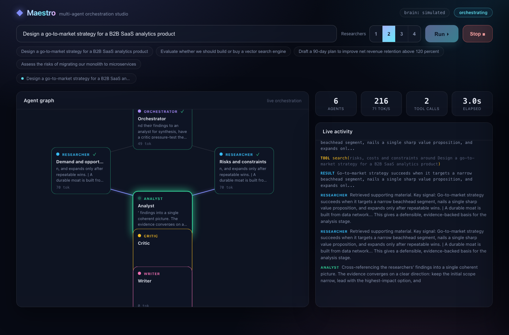
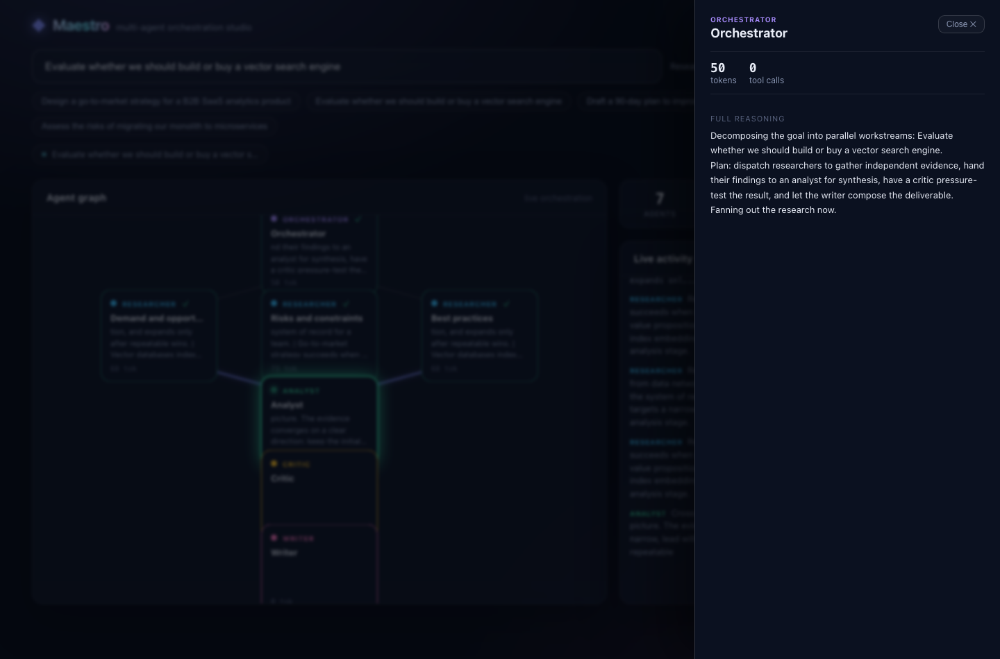
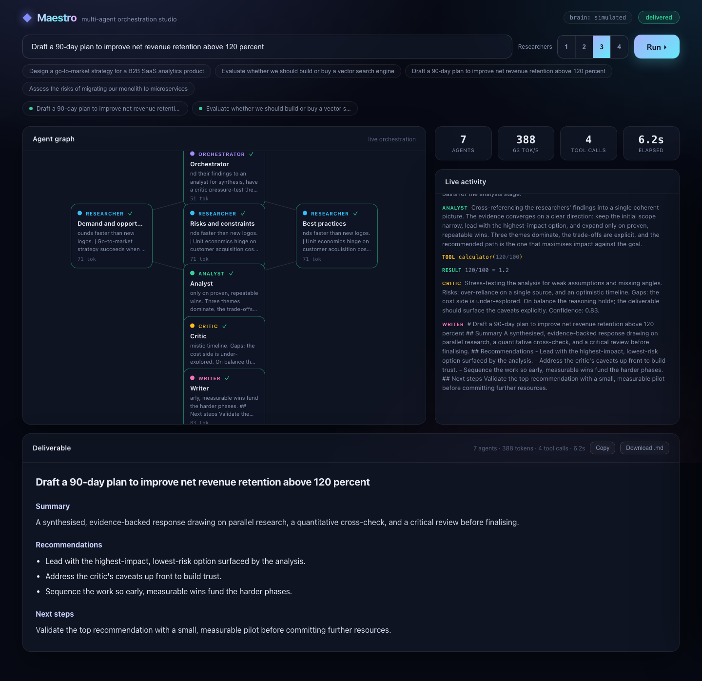

# Maestro

**A live multi-agent orchestration studio. Give it a goal and watch a team of AI agents plan, research, critique, and deliver in real time.**

[](https://github.com/SaadAsif-NU/maestro/actions/workflows/ci.yml)




Maestro turns a one-line goal into a coordinated run across a team of specialised agents (a planner, parallel researchers, an analyst, a critic, and a writer) and renders the whole thing as a live mission-control dashboard: an animated agent graph, streaming thoughts, tool calls, running cost and latency, and a final deliverable.

It is a demonstration of how to build and, just as importantly, how to *observe* an autonomous multi-agent system: a real async orchestration engine, an event-sourced pub/sub bus, and a WebSocket UI that is a pure projection of the event stream.

> **Runs anywhere, instantly.** Maestro ships with a deterministic offline brain, so the studio boots and runs a full multi-agent workflow with no API key and no network. Drop in an `OPENAI_API_KEY` to swap the offline brain for a real model. The orchestration is identical either way.

---

## Highlights

- 🎛️ **Live mission control.** An animated agent graph where nodes light up as they think, edges pulse as work is handed off, and thoughts stream in token by token, alongside live token, tool-call, throughput, and latency metrics.
- 🕹️ **Interactive.** Size the team (1 to 4 researchers), click any agent to inspect its full reasoning and tool calls, stop a run in flight, replay past runs from the history strip, and copy or download the final deliverable.
- 🧠 **Real orchestration engine.** A recognisable multi-agent pattern (plan, fan out parallel research, synthesise, critique, write) built on async Python.
- 🔭 **Event-sourced and observable.** Every action is an event on a per-run bus. The UI, a reconnecting client, run replay, and the tests are all projections of the same ordered, replayable stream.
- 🔌 **Pluggable brains and tools.** Runs offline out of the box; add a free Gemini key (or OpenAI, or any OpenAI-compatible endpoint) for real models. Add tools without touching the agents.
- 🌐 **Build-free frontend.** The UI is served by the backend as static files. No Node toolchain, no bundler. `pip install` and it runs.
- ✅ **Tested and typed.** Async `pytest` across the stack, `mypy`-clean, `ruff`-clean, CI on Python 3.10 to 3.13.

Click any agent to open the inspector and read its full reasoning and tool calls:



## How it works

A run is a fixed, observable pipeline. Each stage streams its work through the event bus.

```
                     ┌──────────────┐
     goal  ─────────▶│ Orchestrator │  plans and assigns workstreams
                     └──────┬───────┘
              ┌─────────────┼─────────────┐
              ▼             ▼             ▼
        ┌──────────┐  ┌──────────┐   (parallel research, each with a
        │Researcher│  │Researcher│    knowledge-base search tool)
        └─────┬────┘  └────┬─────┘
              └──────┬──────┘
                     ▼
                ┌─────────┐   synthesises findings, cross-checks a
                │ Analyst │   figure with the calculator
                └────┬────┘
                     ▼
                ┌─────────┐   pressure-tests the analysis
                │ Critic  │
                └────┬────┘
                     ▼
                ┌─────────┐   composes the final deliverable
                │ Writer  │
                └─────────┘
```

The **engine** starts each run as a background task with its own **event bus**. The **server** exposes that bus over a WebSocket; the browser renders it. Because the bus is event-sourced (it keeps the full ordered log), a client that connects late or reconnects replays the run with no gap and no duplicate.

## Architecture

| Layer | Responsibility |
|---|---|
| `events` | The `Event` model and a replayable async `EventBus` (per-run pub/sub). |
| `brains` | The `Brain` interface, a deterministic offline `SimulatedBrain`, and an OpenAI-compatible adapter. |
| `tools` | The `Tool` interface plus an offline knowledge-base `SearchTool` and a safe `CalculatorTool`. |
| `agents` | An `Agent` that streams reasoning, calls tools, and emits an event for everything it does. |
| `orchestrator` | Coordinates the ensemble: plan, parallel research, synthesise, critique, write. |
| `engine` | Run lifecycle: background execution, status, and event subscription. |
| `server` | FastAPI + WebSocket API, and the static mission-control UI. |

The dependency direction is strict and one-way. The orchestrator depends on the `Brain` and `Tool` *interfaces*, never on concrete implementations, so the offline brain and a real model are perfectly interchangeable.

## Quickstart

```bash
pip install -e ".[dev]"
maestro serve            # open http://localhost:8000
```

Enter a goal (or click an example) and press Run. No keys required.

Prefer the terminal? Run a goal headless and print the deliverable:

```bash
maestro run "Design a go-to-market strategy for a B2B SaaS analytics product"
```

## Using real models

The studio runs offline by default. To use a real model, set a key and restart. The active model shows in the brain badge.

**Google Gemini (free).** Get a free key at [aistudio.google.com/apikey](https://aistudio.google.com/apikey), then:

```bash
export GEMINI_API_KEY=your-key
export MAESTRO_MODEL=gemini-2.0-flash   # optional
maestro serve
```

**OpenAI, or any OpenAI-compatible endpoint.**

```bash
export OPENAI_API_KEY=sk-...
export MAESTRO_MODEL=gpt-4o-mini         # optional
maestro serve
```

Set `OPENAI_BASE_URL` (or `GEMINI_BASE_URL`) to target vLLM, Together, Groq, or a local server.

## Extending

- **New tool** (web search, a vector store, code execution): implement the `Tool` interface and add it to the toolbox. Agents pick it up unchanged.
- **New brain** (Anthropic, Bedrock, a local model): implement the `Brain` streaming interface.
- **New role or topology**: the orchestrator is plain async Python; add an agent and wire its edges.

## Development

```bash
make dev        # install with dev deps
make test       # run the async test suite
make cov        # tests + coverage
make lint       # ruff
make typecheck  # mypy
make serve      # run the studio locally
```

## The deliverable

When the run finishes, the studio renders the writer's output as a clean, structured document.



## License

[MIT](LICENSE) © Saad Asif
